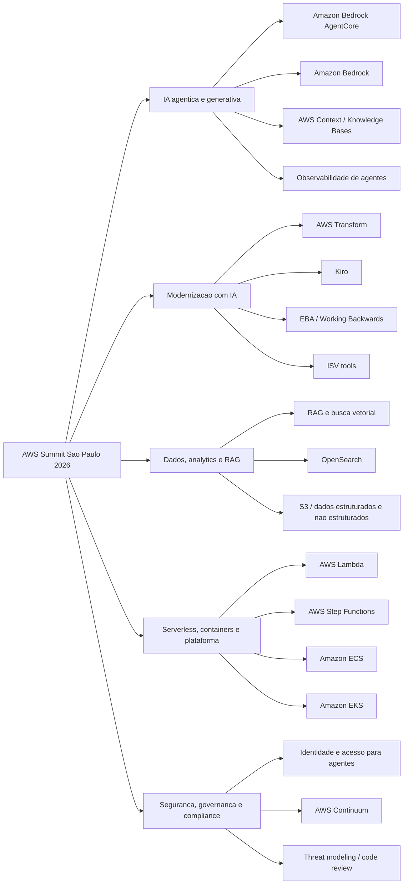

# Mapa de temas

> Status: rascunho
> Dono:
> Ultima revisao: 2026-09-04
> Tags: `aws-summit-2026`, `mapa`, `temas`

```mermaid
flowchart LR
  evento[AWS Summit Sao Paulo 2026] --> ia[IA agentica e generativa]
  evento --> modernizacao[Modernizacao com IA]
  evento --> dados[Dados, analytics e RAG]
  evento --> plataforma[Serverless, containers e plataforma]
  evento --> seguranca[Seguranca, governanca e compliance]

  ia --> agentcore[Amazon Bedrock AgentCore]
  ia --> bedrock[Amazon Bedrock]
  ia --> context[AWS Context / Knowledge Bases]
  ia --> observabilidade[Observabilidade de agentes]

  modernizacao --> transform[AWS Transform]
  modernizacao --> kiro[Kiro]
  modernizacao --> eba[EBA / Working Backwards]
  modernizacao --> isv[ISV tools]

  dados --> rag[RAG e busca vetorial]
  dados --> opensearch[OpenSearch]
  dados --> s3[S3 / dados estruturados e nao estruturados]

  plataforma --> lambda[AWS Lambda]
  plataforma --> stepfunctions[AWS Step Functions]
  plataforma --> ecs[Amazon ECS]
  plataforma --> eks[Amazon EKS]

  seguranca --> identity[Identidade e acesso para agentes]
  seguranca --> continuum[AWS Continuum]
  seguranca --> threat[Threat modeling / code review]
```
