# DevOps e Platform Engineering

> Status: Em revisao
> Dono: Vitor Ferreira
> Ultima revisao: 2026-09-04
> Tags: `aws-summit-2026`, `devops`, `platform-engineering`, `ai-dlc`

## Insights

- AI-DLC amplia o SDLC: agentes passam a apoiar entendimento, planejamento, codificacao, teste, revisao, deploy e operacao.
- Kiro e Amazon Q Developer entram como ferramentas de especificacao, desenvolvimento assistido e reducao de divida tecnica.
- A recomendacao executiva foi medir o processo, nao apenas o codigo gerado.

## Fluxo AI-DLC sugerido

```mermaid
flowchart LR
  ideacao[Ideia / problema] --> spec[Spec e criterios]
  spec --> decomposicao[Decomposicao em tarefas]
  decomposicao --> codigo[Codigo assistido]
  codigo --> testes[Testes e avaliacao]
  testes --> review[Code review e seguranca]
  review --> deploy[Deploy]
  deploy --> operacao[Observabilidade]
  operacao --> melhoria[Backlog de melhoria]
```

## Referencias oficiais

- [Amazon Q Developer](https://aws.amazon.com/q/developer/)
- [AWS Transform](https://aws.amazon.com/transform/)
- [Kiro](https://kiro.dev/)

