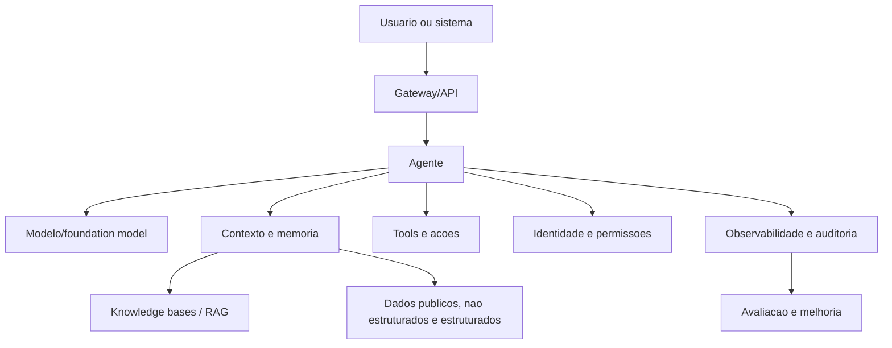

# Generative AI e Machine Learning

> Status: revisao comunitaria
> Dono: Vitor Ferreira
> Ultima revisao: 2026-09-04
> Tags: `aws-summit-2026`, `genai`, `agentic-ai`, `bedrock`

## Insights

- Agentic AI foi o tema mais recorrente do catalogo oficial e das evidencias locais.
- Amazon Bedrock AgentCore aparece como pilar para construir, conectar, proteger, observar e escalar agentes.
- Conhecimento e contexto sao parte da arquitetura: Managed Knowledge Base, web search governado, memoria e dados estruturados/nao estruturados.
- O desafio de producao nao e apenas modelo: envolve logica, contexto, seguranca, deploy, auditoria e escala.

## Arquitetura conceitual de agentes

## Evidencias locais

- Fotos 037-054 em [Fotos](../04-midias-e-evidencias/fotos.md#agrupamentos-curados)
- Sessoes relacionadas: [AIM202](../02-agenda-e-sessoes/sessoes/aim202-democratizacao-governada-de-agentes-de-ia-com-amazon-bedrock-agentcore.md), [DVT203](../02-agenda-e-sessoes/sessoes/dvt203-debug-mais-rapido-governe-melhor-ai-dlc-e-observabilidade.md)

## Referencias oficiais

- [Amazon Bedrock](https://aws.amazon.com/bedrock/)
- [Amazon Bedrock AgentCore](https://aws.amazon.com/bedrock/agentcore/)
- [Amazon Q Developer](https://aws.amazon.com/q/developer/)
- [Amazon SageMaker](https://aws.amazon.com/sagemaker/)
