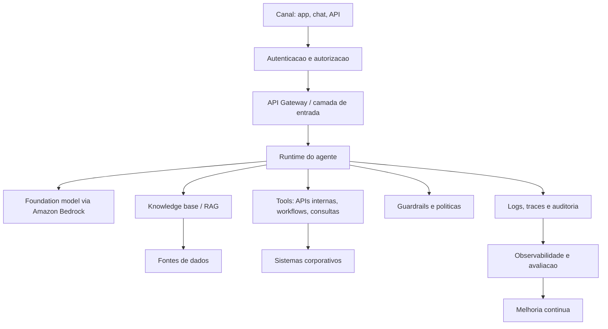
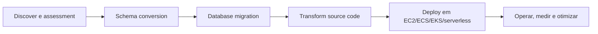

# Arquitetura de referencia

> Status: rascunho
> Dono:
> Ultima revisao: 2026-09-04
> Tags: `aws-summit-2026`, `arquitetura`, `referencia`

## Agente corporativo governado

## Modernizacao assistida por IA

